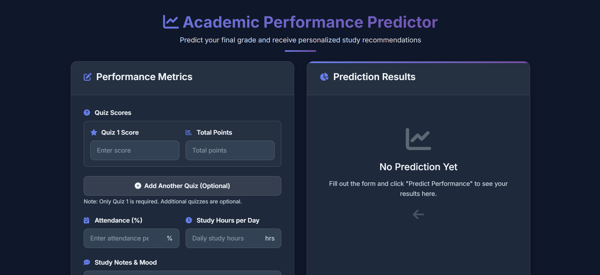
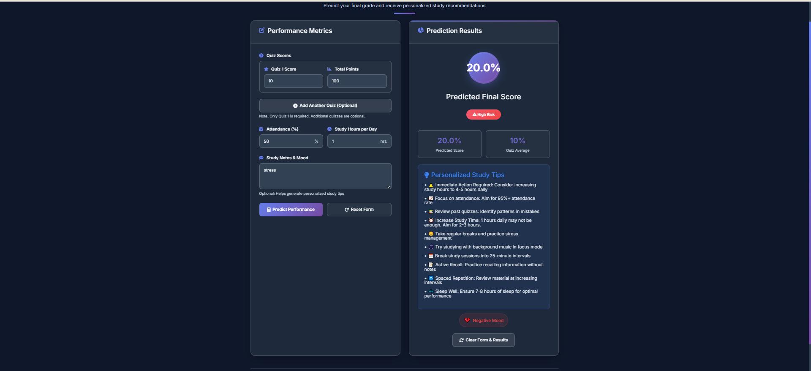
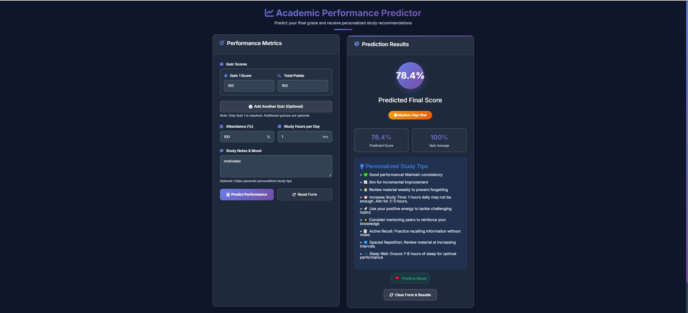
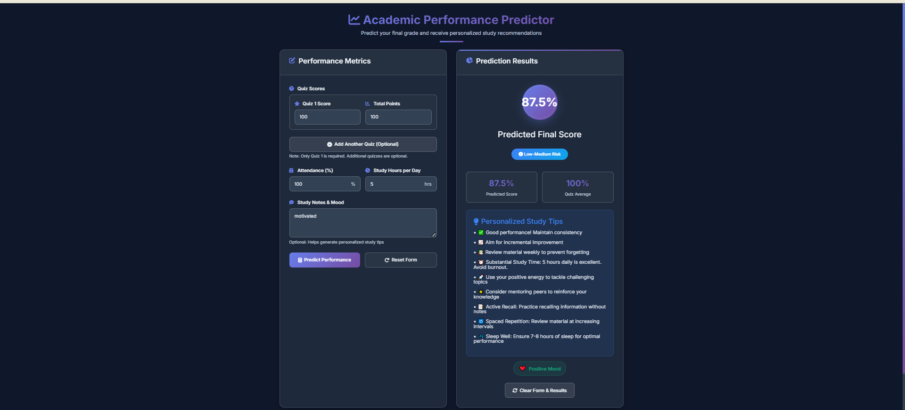
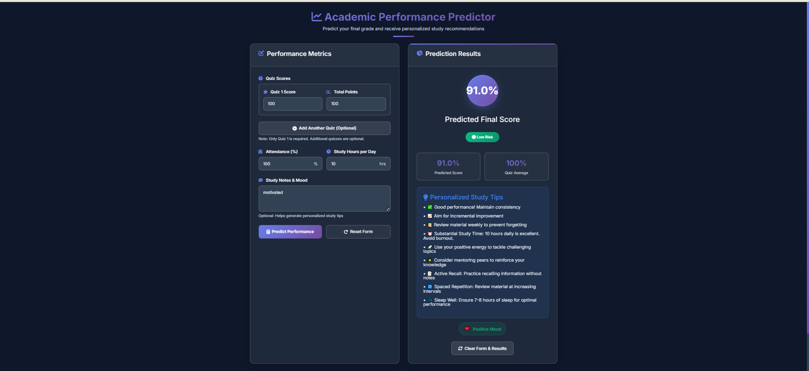
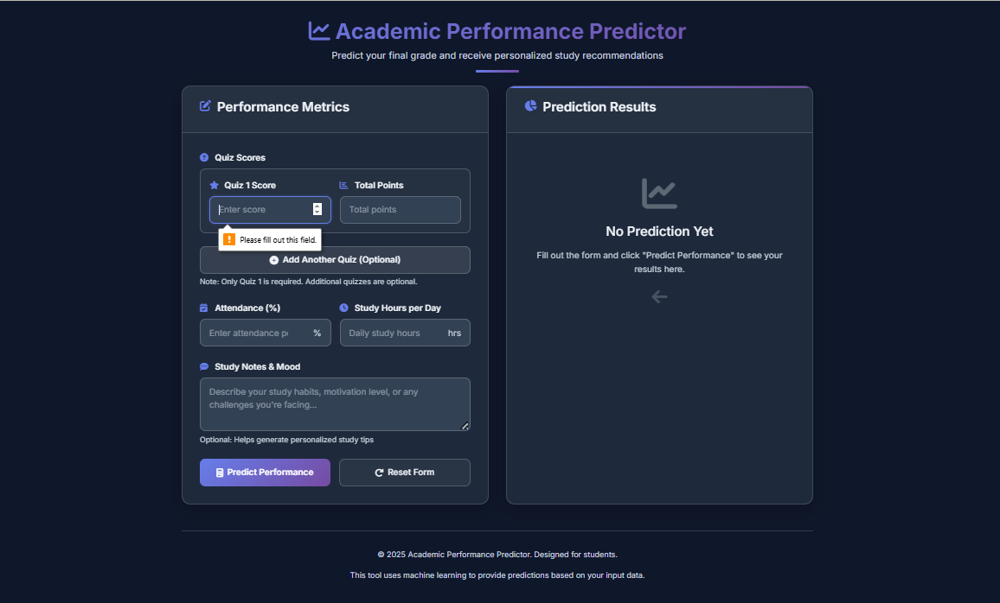
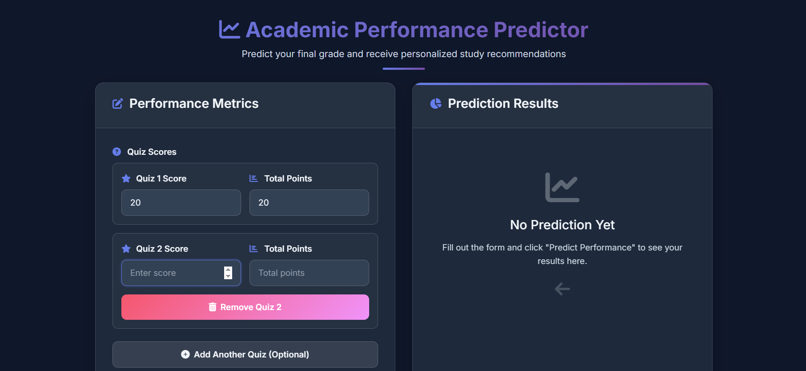

#  Academic Performance Predictor  
A lightweight web application that predicts a student's academic performance category (Low, Medium, High) based on selected risk factors.

No login required. Works instantly using demo data.

---

##  Introduction
The **Academic Performance Predictor** is a simple decision-based web application designed to help visualize student risk levels.  
It categorizes users into different academic risk groups using a rule-based prediction model.

This project is ideal for:
- Demonstrations  
- School research  
- Educational prototypes  
- System analysis & design projects  

---

##  How to Run Locally

### **1. Requirements**
- PHP 7+ or 8+
- XAMPP
- Web browser (Chrome recommended)

### **2. Steps**
1. Download or clone this repository:
git clone https://github.com/Jananana1/academicpredictor.git
2. Move the folder to:
htdocs/ (XAMPP)
3. Start your local server (Apache).
4. Open in browser:
http://localhost/
<academic_predictor>/public/index.php

---

##  How to Use the Web App
1. Enter student information into the form.  
2. Click **Predict**.  
3. The system will show the academic risk category:
- **High Risk**
- **Medium–High Risk**
- **Low–Medium Risk**
- **Low Risk**
4. You can also:
- Add new quiz entries  
- View all generated predictions  
- Delete an entry (demo mode)

No login required. Everything is instant.

---

## Troubleshooting

| Issue | Solution |
|-------|----------|
| App shows blank page | Ensure `/public/index.php` is used |
| CSS not loading | Check `public/assets` path |
| Internal server error | Enable PHP extensions, restart Apache |
| Images not showing | Verify filenames inside `/screenshot/` folder |
| “File not found” | Make sure project folder is inside `htdocs` |

---

## Files & Folder Structure

academic_predictor/
├──screenshot
├── public/
│└── index.php
├── vendor/
│└── src/
|   └── demo/
|       └── student.csv
│── predict.php
|── train.php
│
├── composer.lock
└── composer.json 

##  Screenshots

### Landing Page  

### High Risk Result  

### Medium–High Risk Result  

### Low–Medium Risk Result  

### Low Risk Result  

### No Input Message  

### User Adding New Quiz  

### User Deleting Record  

---

## Links

###  **Live System:**  
https://academic-predictor.free.nf/public/index.php

###  **Canva / PowerPoint Presentation:**  
https://www.canva.com/design/DAG7B_b3UYs/9Q6sVPcwZ1Xtv1MuHZnvxw/edit?utm_content=DAG7B_b3UYs&utm_campaign=designshare&utm_medium=link2&utm_source=sharebutton

###  **YouTube Demo:**  
*(Insert your YouTube link here)*

